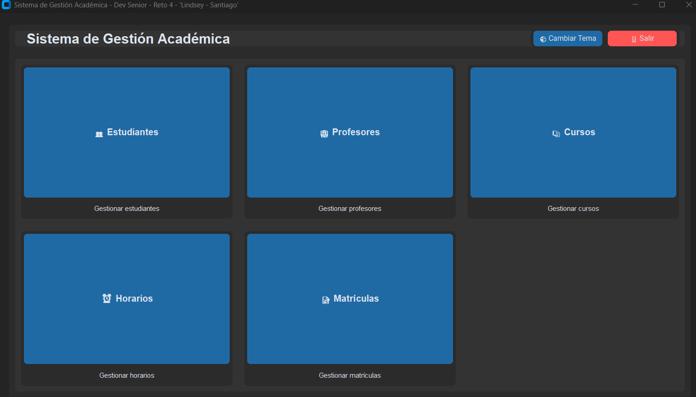
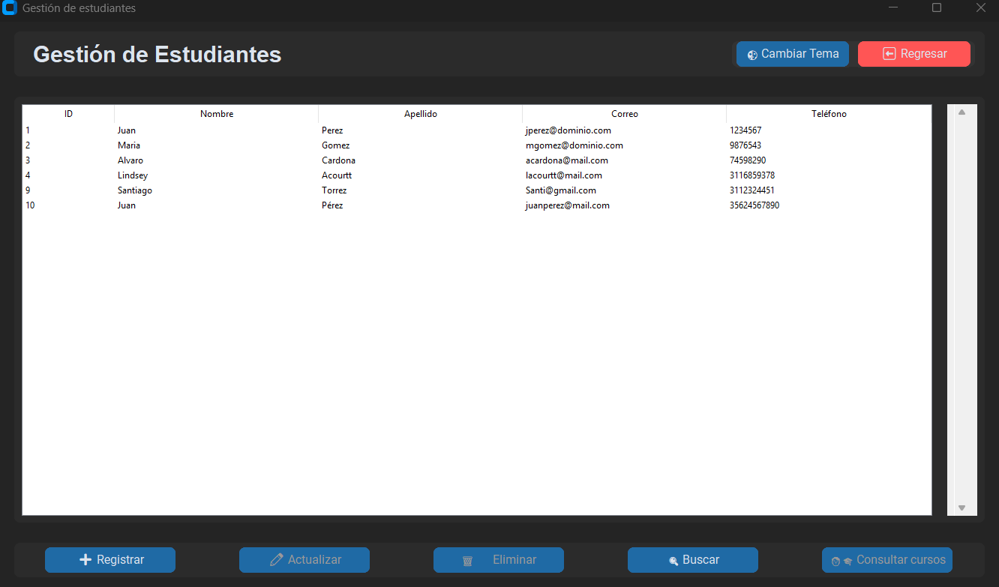
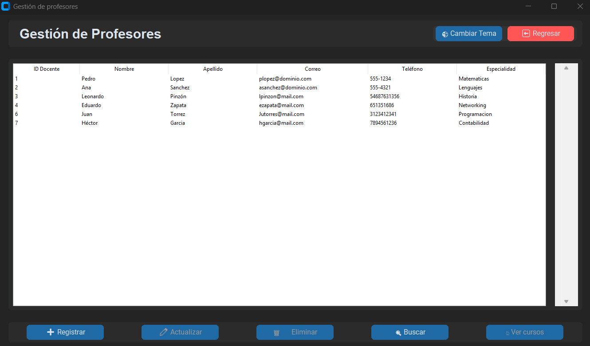
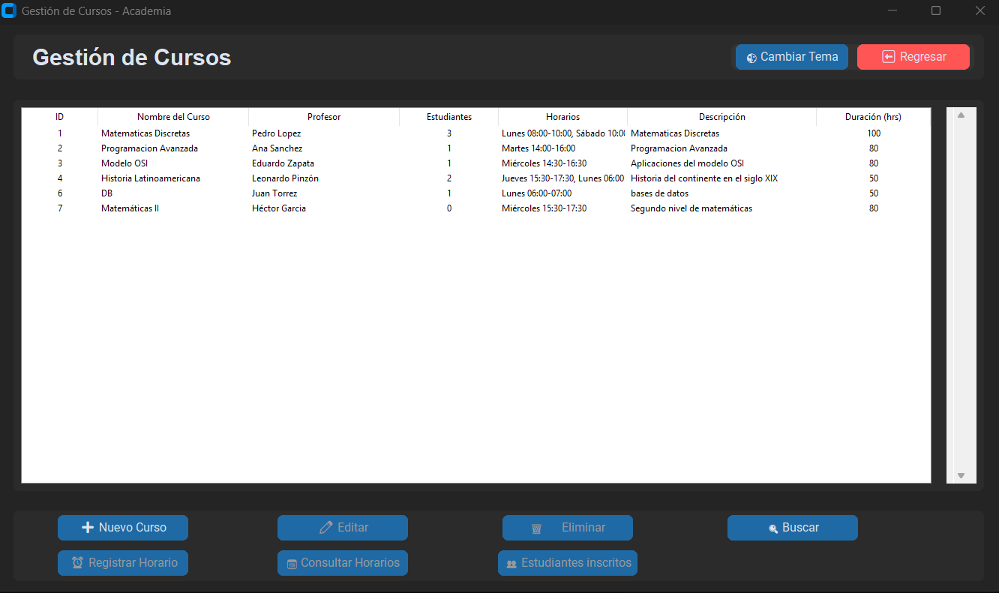
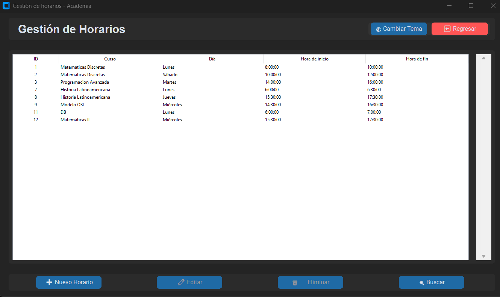
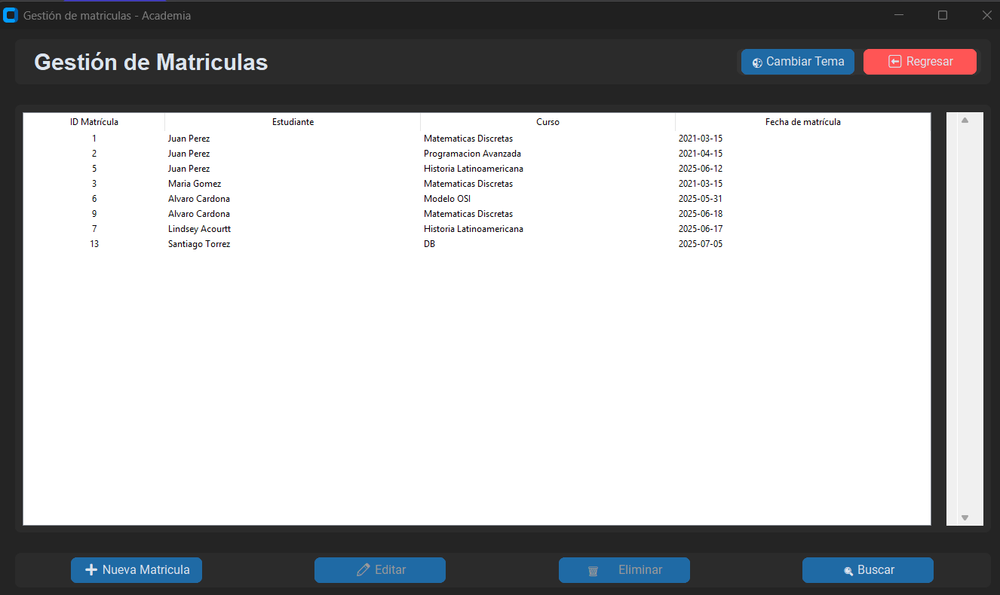
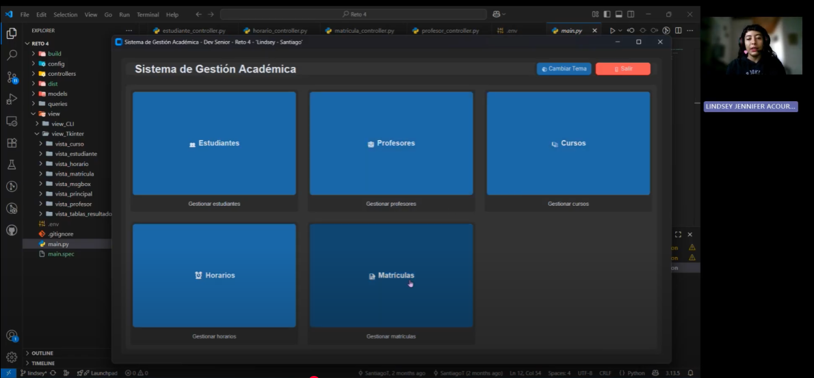

# Sistema de Gestión Académica🧑‍🎓🧑‍🏫📚📑

El presente repositorio corresponde a una aplicación de software que permite gestionar los procesos básicos de una academia, incluyendo el registro de estudiantes, profesores, cursos, horarios y matrículas. 

El sistema fue desarrollado con Python, y la interfaz gráfica con Tkinter. La gestión de la base de datos se hace a través de una conexión a MySQL debe reflejar correctamente las relaciones entre entidades, implementar operaciones CRUD y permitir consultas útiles desde un enfoque académico.

# Objetivos

# Requerimientos de la aplicación

La academia ofrece múltiples cursos, cada uno de los cuales es dictado por un profesor. Los estudiantes pueden matricularse en uno o varios cursos, y cada curso puede tener varios estudiantes inscritos. Adicionalmente, cada curso tiene asignado un horario específico para sus sesiones, el cual puede incluir varios días y franjas horarias por semana.
El sistema debe permitir registrar y consultar los datos de estudiantes, profesores, cursos, matrículas y horarios, además de reflejar correctamente las relaciones entre estas entidades en la base de datos. Teniendo en cuenta esto, la aplicación cumple con los siguiente requerimientos:

1.	Registrar nuevos estudiantes y consultar su información.
2.	Registrar profesores y consultar qué cursos dictan.
3.	Crear cursos y asignarles un profesor responsable.
4.	Registrar uno o varios horarios para cada curso.
5.	Matricular estudiantes en cursos específicos.
6.	Consultar los cursos en los que está inscrito un estudiante.
7.	Consultar los estudiantes inscritos en un curso.
8.	Consultar los horarios asignados a un curso.
9.	Eliminar matrículas sin afectar la información de los estudiantes ni de los cursos.


# Capas del proyecto

```
reto-4-dev-senior-gestion-academica/
├── config/
│   └── appearance.py
│   └── database.py
├── controllers/
│   └── curso_controller.py
│   └── estudiante_controller.py
│   └── horario_controller.py
│   └── matricula_controller.py
│   └── profesor_controller.py
├── models/
│   └── Curso.py
│   └── Estudiante.py
│   └── Horario.py
│   └── Matricula.py
│   └── Profesor.py
├── queries/
│   └── comandos de mysql.sql
├── view/
│   └── view_CLI/
│   └── view_TKinter/
│         └── vista_curso/
│         └── vista_estudiante/
│         └── vista_horario/
│         └── vista_matricula/
│         └── vista_msgbox/
│         └── vista_principal(
│         └── vista_profesor/
│         └── vista_tablas_resultados/
├── main.py
```

# Descripción de la aplicación

La aplicación consta de una ventana principal o menu principal para gestionar una academia. Esta ventana me puede redireccionar a otras 5 ventanas que son la de Cursos, Profesores, Horarios, Matriculas y Estudiantes. Estas ventanas cuentan con el boton para cambiar de tema y regresar al menu principal. 



Al dar click en el boton de "Estudiantes" se despliega la siguiete ventana con toda su funcionalidad para gestionar estudiantes:



El botón de "Profesores"  abrirá la ventana para gestionar profesores:



Al dar click en el boton de "Cursos" se despliega la siguiete ventana con toda su funcionalidad para gestionar cursos:



El botón de "Horarios"  abrirá una nueva ventana para gestionar horarios:



El ultimo boton es el de Matriculas y al dar click en el nos llevara a la ventana para gestionar matriculas:
 

Por ultimo, nuestra app cuenta con un boton para cambiar el tema y otro para salir de la aplicacion, se mostrará un mensaje para confirmar que queremos salir y se cerrará nuestra aplicacion de Gestion de cursos para una academia.


# Instalador

La carpeta instalador contiene el archivo ```mysetup.exe``` el cual permite la instalación de este código como una aplicación de escritorio en Windows. En este caso, la base de datos se almacena en la nube usando la plataforma Railway. 

# Requerimientos
tkinter
customtkinter
mysql.connector
CTkMessagebox
tkcalendar
datetime
sys

# Vídeo

Dar clic a la imagen para ser redirigdo al vídeo en Youtube.
[](https://www.youtube.com/watch?v=CkaNK7CJsyY)


# Versión de Python

Desarrollado en Python 3.13.0.
